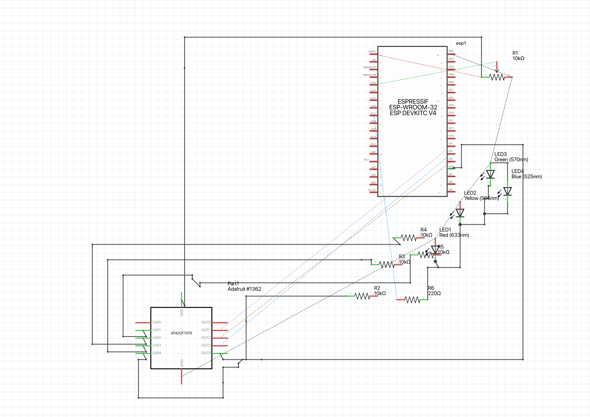

# Musical Seashells 

## Documentation 

This project was inspired by the concept of transforming a travel souvenir into a wearable musical instrument. Originating from the tradition of exchanging "Kandi" bracelets at electronic music festivals, these beaded bracelets symbolize connection and creativity. Without beads at my disposal, I opted for a seashell necklace purchased in Hawaii. The larger seashells were coated with conductive paint, and jumper pins attached with copper wire introduced capacitive touch functionality. This setup was designed to send analog messages to an Arduino, which in turn would emit MIDI signals to GarageBand. The necklace's jumper pins were linked to an AT42QT1070 standalone capacitive touch sensor, feeding signals to the Arduino's GPIO pins. The initial aim was for four seashells to play the Chromatic scale, depending on the capacitance detected from finger contact. However, the AT42QT1070's limitations became apparent, lacking the proximity sensing and multi-touch capabilities of sensors like the MPR121, thus hindering reliable MIDI output based on touch intensity.

To circumvent this, a potentiometer was integrated, allowing for the adjustment of musical scales to align with the chromatic scale. Yet, the sensitivity of the seashells proved problematic, as mere proximity could inadvertently trigger notes. To mitigate this, I incorporated 10-12K resistors to dull the sensitivity. Despite these efforts, the seashells' contact with clothing still posed a challenge to reliable performance. The solution evolved into painting a Hawaiian dancer on a canvas, adorned with the seashell necklace, thus offering a more stable medium for MIDI output.

MIDI communication was achieved through the Arduino BLE-MIDI Transport library, leveraging the FortySevenEffects Arduino MIDI Library on an ESP-32. The choice of BLE over USB was necessary due to the ESP32's lack of an inbuilt USB controller and serial MIDI applications on Apple M1 MacBooks being deprecated, due to ARM architecture compatibility issues.

Although this project significantly diverged from its original vision, it retains the essence of a wearable musical instrument. Now reimagined as an interactive painting, it serves as a reminder of past travels, embodying the joy and memories associated with them. For future iterations, considering a sensor like the MPR121 over the AT42QT1070 would provide enhanced control over detected capacitance, promising a closer realization of the project's initial concept.

### Concept Images

### Schematic Diagramß
​

### Final Artifact
​

### Video

### References
1. "Potentiometer Documentation." *SunFounder*, docs.sunfounder.com/projects/esp32-starter-kit/en/latest/arduino/basic_projects/ar_pot.html#ar-potentiometer. Accessed 10 Feb. 2024.

2. Lathoub. "Arduino BLE-MIDI Transport Library." *GitHub*, github.com/lathoub/Arduino-BLE-MIDI?tab=readme-ov-file. Accessed 13 Feb. 2024.

3. FortySevenEffects. "Arduino MIDI Library." *GitHub*, github.com/FortySevenEffects/arduino_midi_library. Accessed 13 Feb. 2024.

4. "Bluetooth MIDI Connect." *App Store*, apps.apple.com/us/app/bluetooth-midi-connect/id1074606480?mt=12. Accessed 13 Feb. 2024.

5. "GarageBand for MacOS." *Apple*, www.apple.com/ca/mac/garageband/. Accessed 12 Feb. 2024.

### Components
    - ESP32 WROOM 32E
    - Breadboard
    - Jumper Pins
    - AT42QT1070 Capacitive Touch Sensor
    - 220 OHM Resistor
    - 10-12K Resistors x4
    - Potentiometer
    - LED pins x 4
