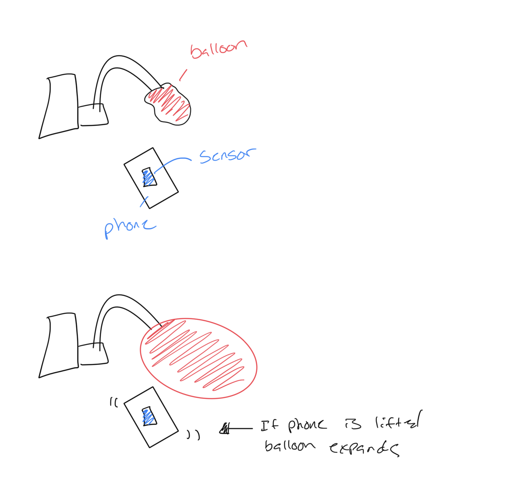
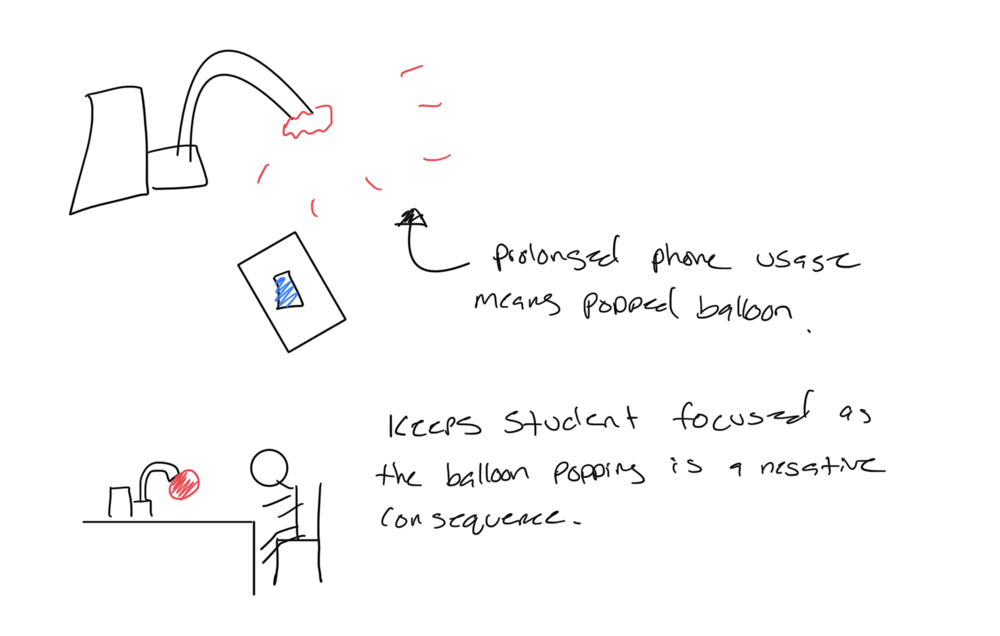
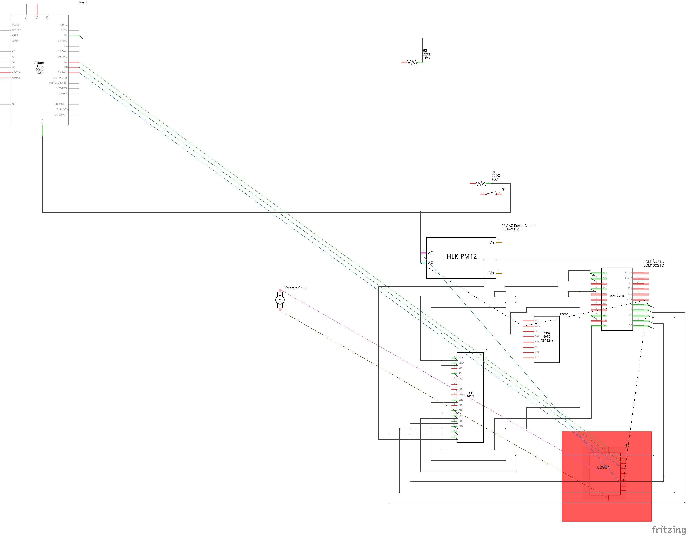

# The PopSequence

## Documentation 

### Overview

In an era where digital distractions are incessantly vying for our attention, maintaining focus during study sessions has become a formidable challenge, particularly for students. The PopSequence project embodies an innovative approach to tackle this issue, leveraging the a popping balloon as a deterrent. This project is designed not merely as a punitive measure but as a tangible visualization of the time spent away from study due to phone distractions. Each lift of the phone triggers a vacuum pump, inflating a balloon attached to the setup. The growing size of the balloon serves as a real-time indicator of the accumulated distractions, culminating in a popping sound if the phone is lifted excessively.

### Inspiration

This project was motivated by the need to create a physical reminder for students to stay engaged with their studies by minimizing phone usage, by employing a negative reinforcement mechanism where the adverse consequence (the balloon popping) is introduced to decrease the undesired behavior (phone usage during study times). However, PopSequence goes a step beyond just deterrence. By visualizing the amount of time distracted in the form of a balloon's expansion, it offers a direct, tangible representation of time wasted, thus encouraging students to reflect on their habits and make conscious decisions to focus.

### How It Works

By integrating MPU-6050 accelerometer and gyroscope sensor, attached to the back of a phone, to detect when the phone is lifted. When the user presses a button, it will activate a 25 minute study window from the current time, displayed on a I2C display, where lifting up your phone will cause the motor to be activated through a L98N motor-driver controlling a vacuum pump connected to the Arduino board, initiating the inflation of the balloon, and continues until the phone is put back down. 

### Concept Images

### Schematic Diagram
​

### Final Artifact
​

### Video

### References
1. "I2C LCD1602." SunFounder ESP32 Starter Kit Documentation, SunFounder, https://docs.sunfounder.com/projects/esp32-starter-kit/en/latest/components/component_i2c_lcd.html. Accessed 10 Mar. 2024.
2. "Digital Input Pull-Up." Arduino, https://docs.arduino.cc/tutorials/generic/digital-input-pullup. Accessed 8 Mar. 2024.
"Arduino and MPU6050 Accelerometer and Gyroscope Tutorial." HowToMechatronics, 3. https://howtomechatronics.com/tutorials/arduino/arduino-and-mpu6050-accelerometer-and-gyroscope-tutorial/. Accessed 12 Mar. 2024.
4. "ARDUINO + VACUUM PUMP EXPLAINED #vacuumpump #arduino #esp32." YouTube, uploaded by [Mikael Abehsera], 12 Mar. 2024, https://www.youtube.com/watch?v=UkuoB51Vbrs.

### Components
    - Arduino Uno R3
    - 2 Bread Boards
    - Jumper Pins
    - MPU 6050 
    - 1 x 100 OHM Resistor
    - 1 x 10K OHM Resistor
    - 12V Vacuum Pump
    - L298N Motor Driver Controller
    - Plastic Tubing
    - I2C Display
    - Balloons 
    - 12V AC Adapter
    - AC Barrel Tube to Bare Wire adapter 

