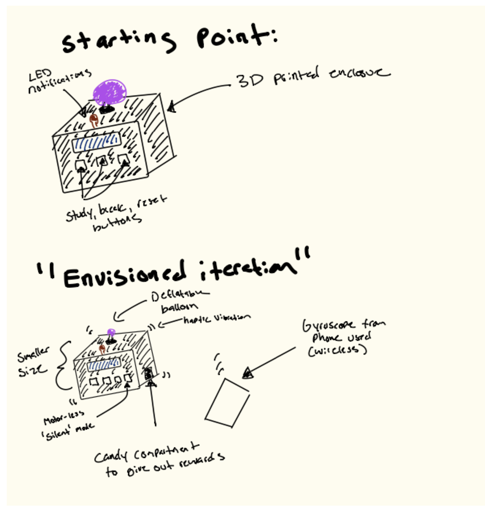
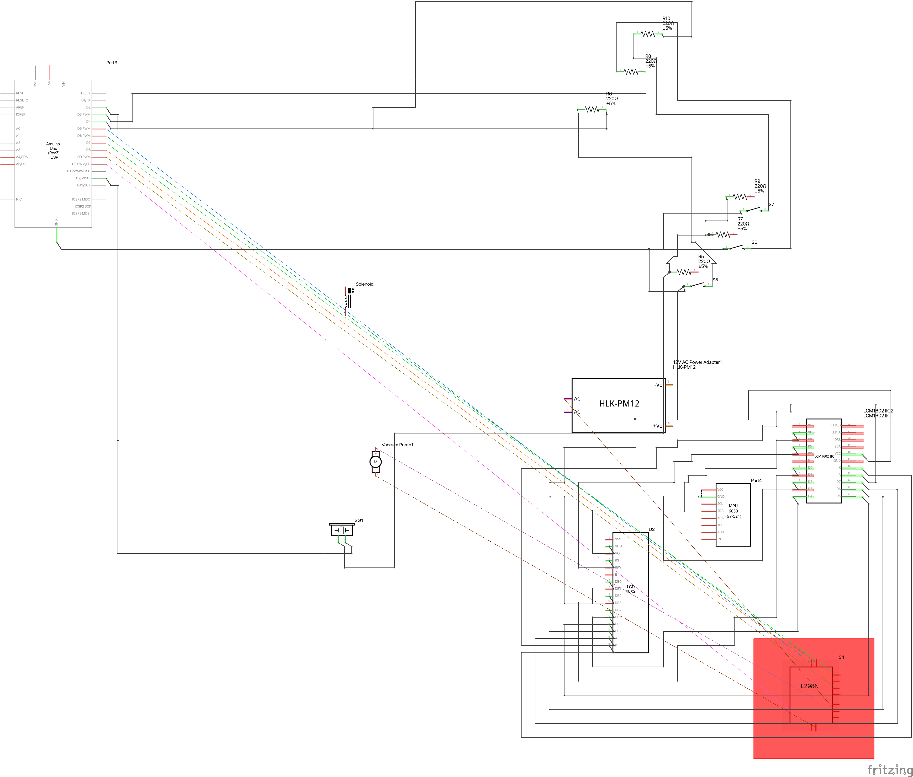
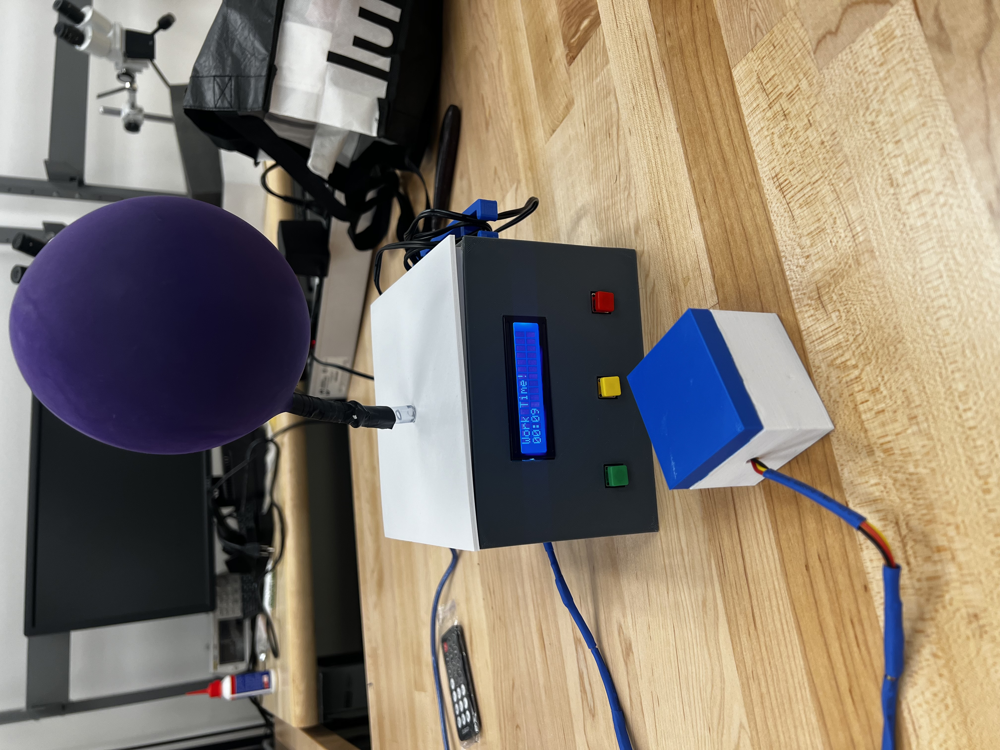

# The PopSequence 2.0

## Documentation 

### Overview

In an era where digital distractions are incessantly vying for our attention, maintaining focus during study sessions has become a formidable challenge, particularly for students. The PopSequence project embodies an innovative approach to tackle this issue, leveraging a popping balloon as a deterrent. This new iteration of the PopSequence has been improved by featuring a new 3D printed outer shell, which is an upgrade from using a cardboard box. The buttons and display are now embedded within the front panel for ease of access and use. In addition to external changes, a 12V miniature 3-way solenoid valve has been installed to bleed air out of the balloon, allowing the balloon to reset after each time the timer is started. 

### Conceptual Story

PopSequence 1.0 was motivated by the need to create a physical reminder for students to stay engaged with their studies by minimizing phone usage. It employed a negative reinforcement mechanism where an adverse consequence (the balloon popping) was introduced to decrease the undesired behavior (phone usage during study times). However, there were a few areas that needed refinement, such as the inability to bleed off air pressure, the lack of a break function, and the crude presentation. For version 2.0, I envisioned it to be a permanent project that would not look out of place sitting on top of a desk, requiring a sturdier and more colorful design. Second, the inability to release air was limiting if a "reset" was needed, and the user had to open the cardboard box and remove the plastic tubing for the air to escape, which was inconvenient. 

Version 1.0 was a simple timer that set a target of 25 minutes in advance, inspired by the Pomodoro technique. Version 2.0 features nearly full Pomodoro functionality, where a 5-minute break is implemented after 25 minutes, and the timer restarts for another 25-minute session. The user is also able to pause and reset the timer, which was a feature lacking in 1.0. 

Lastly, a passive buzzer was added to give audible feedback for when the timer/break has started. 

### How It Works

The original implementation involved integrating an MPU-6050 accelerometer and gyroscope sensor, attached to the back of a phone, to detect when the phone is lifted. When the user presses a button, it activates a 25-minute study window from the current time, displayed on an I2C display. Lifting the phone causes the motor to be activated through an L98N motor-driver controlling a vacuum pump connected to the Arduino board, initiating the inflation of the balloon. The inflation continues until the phone is put back down. 

Version 2.0 implements a 2 Position 3 Way DC12V solenoid air valve connected to the L98N motor-driver for control. Whenever the timer is started, the solenoid is closed to prevent air from escaping, allowing the balloon to grow bigger if the phone is lifted. When the timer is off/reset, the solenoid opens, effectively resetting the balloon. 

### Difficulties

The difficulty of this iteration comes from assembling 3D printed parts into one cohesive object, especially without prior 3D printing experience. I had multiple attempts where something I printed wasn't quite up to measure. Learning how to choose CAD tools also added additional time. Due to the time spent designing, printing, and re-iterating through CAD models, I would have liked to add additional features such as a positive reward system that gives candy on a successful Pomodoro attempt. 

### Full List of Changes:
- Cardboard box has been replaced with a 3D printed shell.
- Front Panel contains 3 buttons to start, pause and reset the pomodoro timer.
- Start button removed from MPU6050 block and moved to the front panel.
- Python time source script has been removed in favor of starting a pomodoro timer.
- Break functionality added.
- Passive Buzzer added to provide audiable feedback when the timer or a break has started.
- 12V miniature 3-way solenoid valve has been added to bleed off air from the balloon when the timer is not active.
- Wire wrapping rack added to the 3D shell to house the 12V AC adapter wires.                       

---

### Concept Images

### Schematic Diagram

### Final Artifact

### Video

---

### References
1. "I2C LCD1602." SunFounder ESP32 Starter Kit Documentation, SunFounder, https://docs.sunfounder.com/projects/esp32-starter-kit/en/latest/components/component_i2c_lcd.html. Accessed 10 Mar. 2024.
2. "Digital Input Pull-Up." Arduino, https://docs.arduino.cc/tutorials/generic/digital-input-pullup. Accessed 8 Mar. 2024.
3. "Arduino and MPU6050 Accelerometer and Gyroscope Tutorial." HowToMechatronics, https://howtomechatronics.com/tutorials/arduino/arduino-and-mpu6050-accelerometer-and-gyroscope-tutorial/. Accessed 12 Mar. 2024.
4. "ARDUINO + VACUUM PUMP EXPLAINED #vacuumpump #arduino #esp32." YouTube, uploaded by [Mikael Abehsera], 12 Mar. 2024, https://www.youtube.com/watch?v=UkuoB51Vbrs.

### Components
- Arduino Uno R3
- 2 Breadboards
- Jumper Pins
- 3 Buttons
- 3D Printer + Filament
- Heated Shrink Wrap
- MPU 6050 
- 6 x 240 Ohm Resistors
- 12V Vacuum Pump
- 2 Position 3 Way DC12V 0.19A Solenoid Valve
- L298N Motor Driver Controller
- Plastic Tubing
- I2C Display
- Balloons 
- 12V AC Adapter
- AC Barrel Tube to Bare Wire adapter
